---
## Front matter
lang: ru-RU
title: Лабораторная Работа №6
subtitle: Простейший шаблон
author:
  - Сильвен Макс Грегор Филс , НКАбд-03-22

## i18n babel
babel-lang: russian
babel-otherlangs: english

## Formatting pdf
toc: false
toc-title: Содержание
slide_level: 2
aspectratio: 169
section-titles: true
theme: metropolis
header-includes:
 - \metroset{progressbar=frametitle,sectionpage=progressbar,numbering=fraction}
 - '\makeatletter'
 - '\beamer@ignorenonframefalse'
 - '\makeatother'
---

## Цель работы
 - Ознакомление с инструментами поиска файлов и фильтрации текстовых дан-
ных. Приобретение практических навыков: по управлению процессами (и заданиями), по проверке использования диска и обслуживанию файловых систем.

## Задание
 
1. Осуществите вход в систему, используя соответствующее имя пользователя.
2. Запишите в файл file.txt названия файлов, содержащихся в каталоге /etc. До-
пишите в этот же файл названия файлов, содержащихся в вашем домашнем
каталоге.
3. Выведите имена всех файлов из file.txt, имеющих расширение .conf, после
чего запишите их в новый текстовой файл conf.txt.
4. Определите, какие файлы в вашем домашнем каталоге имеют имена, начи-
навшиеся с символа c? Предложите несколько вариантов, как это сделать.
5. Выведите на экран (по странично) имена файлов из каталога /etc, начинаю-
щиеся с символа h.
6. Запустите в фоновом режиме процесс, который будет записывать в файл
~/logfile файлы, имена которых начинаются с log.

## Задание
7. Удалите файл ~/logfile.
8. Запустите из консоли в фоновом режиме редактор gedit.
9. Определите идентификатор процесса gedit, используя команду ps, конвейер
и фильтр grep. Как ещё можно определить идентификатор процесса?
10. Прочтите справку (man) команды kill, после чего используйте её для завер-
шения процесса gedit.
11. Выполните команды df и du, предварительно получив более подробную
информацию об этих командах, с помощью команды man.
12. Воспользовавшись справкой команды find, выведите имена всех директо-
рий, имеющихся в вашем домашнем каталоге

## Теоретическое введение

- Есть интерфейсе командной строки очень полезная возможность перенаправ-
ления (переадресации) ввода и вывода (англ. термин I/O Redirection). Как мы
уже заметили, многие программы выводят данные на экран. А ввод данных в
терминале осуществляется с клавиатуры. С помощью специальных обозначений
можно перенаправить вывод многих команд в файлы или иные устройства выво-
да (например, распечатать на принтере). Тоже самое и со вводом информации,
вместо ввода данных с клавиатуры, для многих программ можно задать счи-
тывание символов их файла. Кроме того, можно даже вывод одной программы
передать на ввод другой программе. [Entr:bash?]
К каждой программе, запускаемой в командной строке, по умолчанию под-
ключено три потока данных:
STDIN (0) — стандартный поток ввода (данные, загружаемые в программу).
STDOUT (1) — стандартный поток вывода (данные, которые выводит программа).
По умолчанию — терминал. STDERR (2) — стандартный поток вывода диагно-
стических и отладочных сообщений (например, сообщениях об ошибках). По
умолчанию — терминал. [Conv:bash?]
Pipe (конвеер) – это однонаправленный канал межпроцессного взаимодей-
ствия. Термин был придуман Дугласом Макилроем для командной оболочки Unix
и назван по аналогии с трубопроводом. Конвейеры чаще всего используются
в shell-скриптах для связи нескольких команд путем перенаправления вывода
одной команды (stdout) на вход (stdin) последующей, используя символ конвеера
‘|’. [Pipes:bash?]

## Выполнение лабораторной работы

1. Запишите в файл file.txt названия файлов, содержащихся в каталоге /etc. До-
пишите в этот же файл названия файлов, содержащихся в вашем домашнем
каталоге.(рис. [-@fig:fig1])(рис. [-@fig:fig1.1])(рис. [-@fig:fig2])

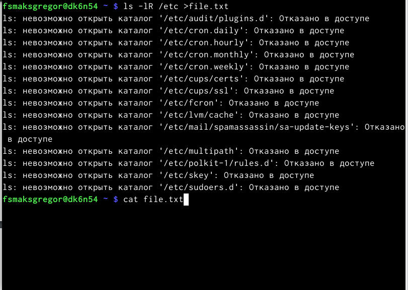{#fig:1 width=110%}
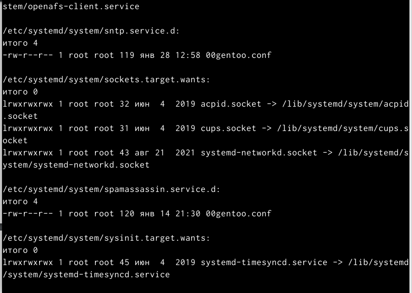{#fig:1.1 width=110%}
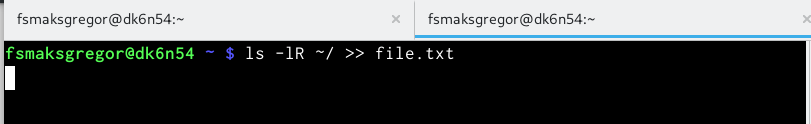{#fig:2 width=110%}

## Выполнение лабораторной работы
2. Запишите в файл file.txt названия файлов, содержащихся в каталоге /etc. До-
пишите в этот же файл названия файлов, содержащихся в вашем домашнем
каталоге. (рис. [-@fig:fig3])(рис. [-@fig:fig4])

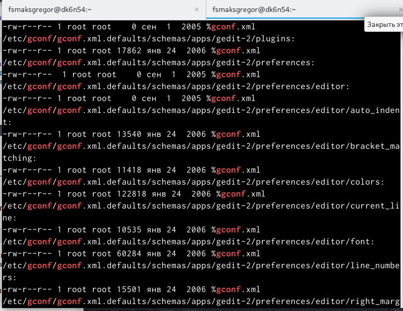{#fig:3 width=110%}
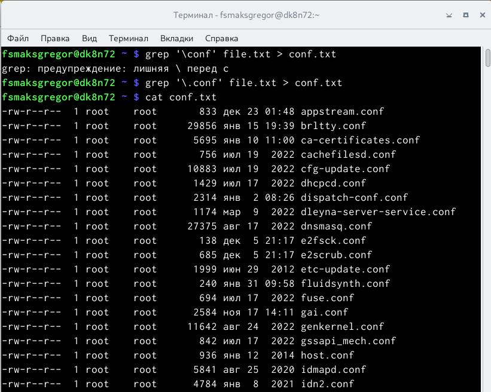{#fig:4 width=110%}

## Выполнение лабораторной работы
3. Выведите имена всех файлов из file.txt, имеющих расширение .conf, после чего запишите их в новый текстовой файл conf.txt.  (рис. [-@fig:fig5]) , (рис. [-@fig:fig6])

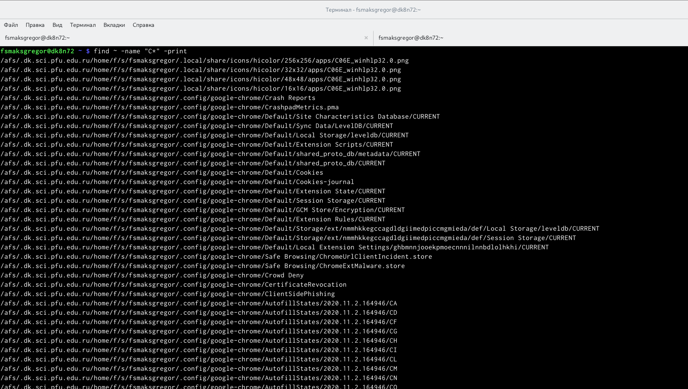{#fig:5 width=110%}
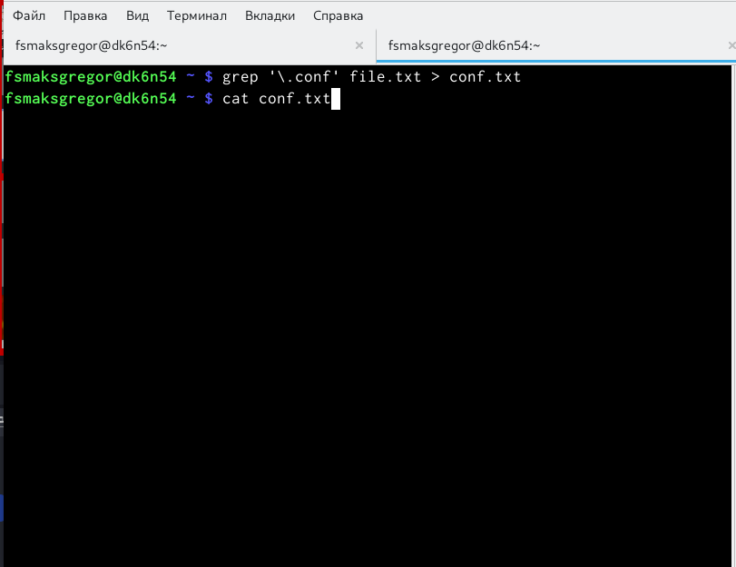{#fig:6 width=110%}

## Выполнение лабораторной работы
4. Определите, какие файлы в вашем домашнем каталоге имеют имена, начинавшиеся с символа c? Предложите несколько вариантов, как это сделать. (рис. [-@fig:fig7])

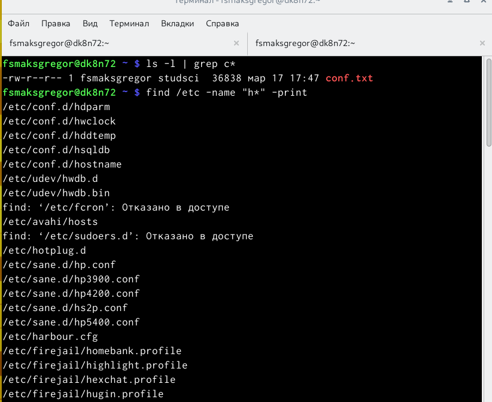{#fig:7 width=110%)
 
## Выполнение лабораторной работы
5. Запустите в фоновом режиме процесс, который будет записывать в файл
~/logfile файлы, имена которых начинаются с log.(рис. [-@fig:fig8])
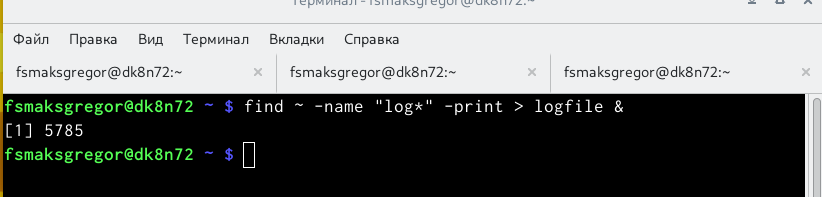{#fig:8 width=110%}

## Выполнение лабораторной работы
6. Удалите файл ~/logfile. (рис. [-@fig:fig9])
{#fig:9 width=110%}

## Выполнение лабораторной работы
7. Запустите из консоли в фоновом режиме редактор gedit.(рис. [-@fig:fig10])
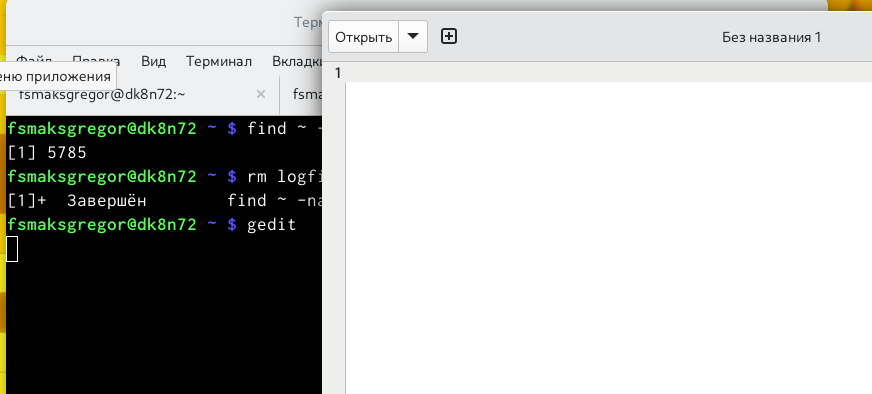{#fig:10 width=110%}

## Выполнение лабораторной работы

8. Определите идентификатор процесса gedit, используя команду ps, конвейер
и фильтр grep. Как ещё можно определить идентификатор процесса? (рис. [-@fig:fig11])
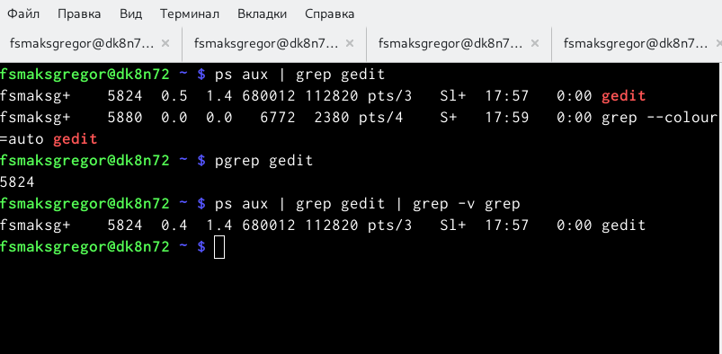{#fig:11 width=110%}

## Выполнение лабораторной работы
9. Прочтите справку (man) команды kill, после чего используйте её для завер-
шения процесса gedit. (рис. [-@fig:fig12])(рис. [-@fig:fig13])
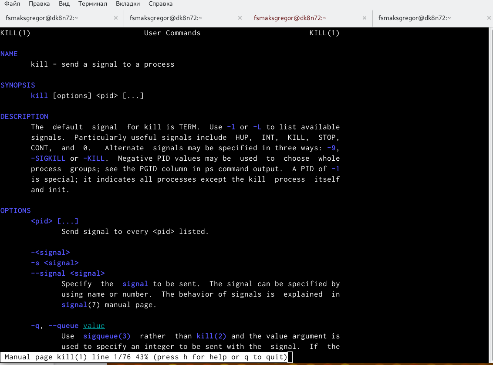{#fig:12 width=110%}
{#fig:13 width=110%}

## Выполнение лабораторной работы
10. Выполните команды df и du, предварительно получив более подробную
информацию об этих командах, с помощью команды man.(рис. [-@fig:fig14])(рис. [-@fig:fig15])(рис. [-@fig:fig16])(рис. [-@fig:fig17])
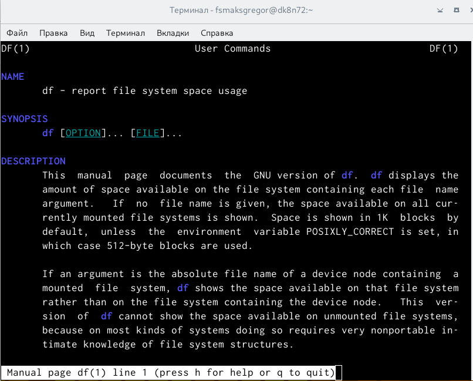{#fig:14 width=110%}
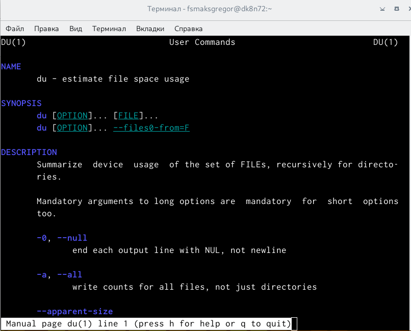{#fig:15 width=110%}
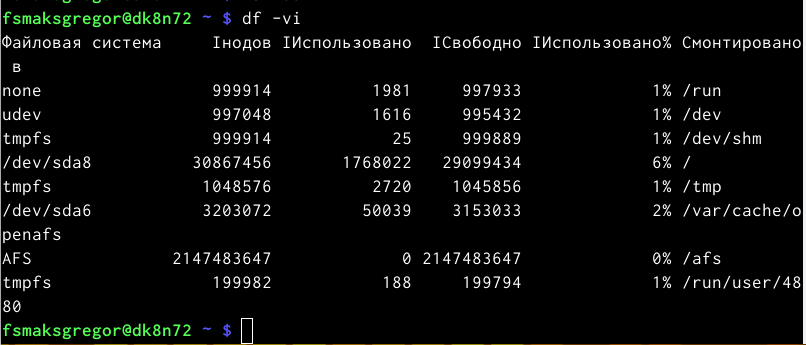{#fig:16 width=110%}
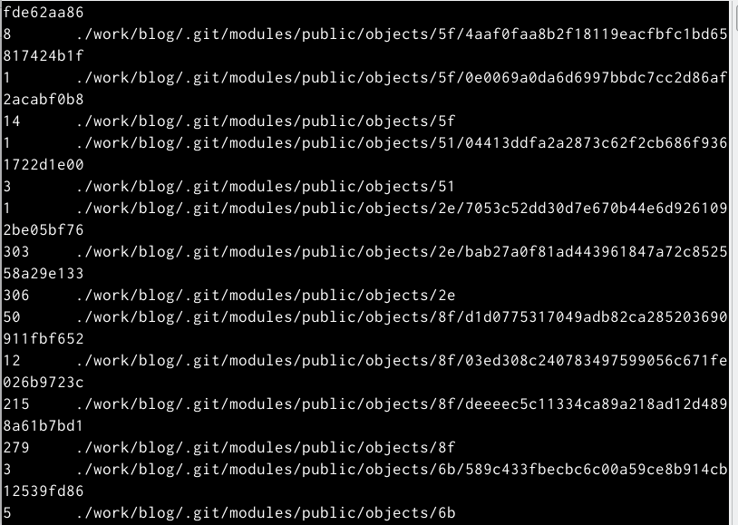{#fig:17 width=110%}

## Выполнение лабораторной работы
11. Воспользовавшись справкой команды find, выведите имена всех директо-
рий, имеющихся в вашем домашнем каталоге. (рис. [-@fig:fig18])(рис. [-@fig:fig19])
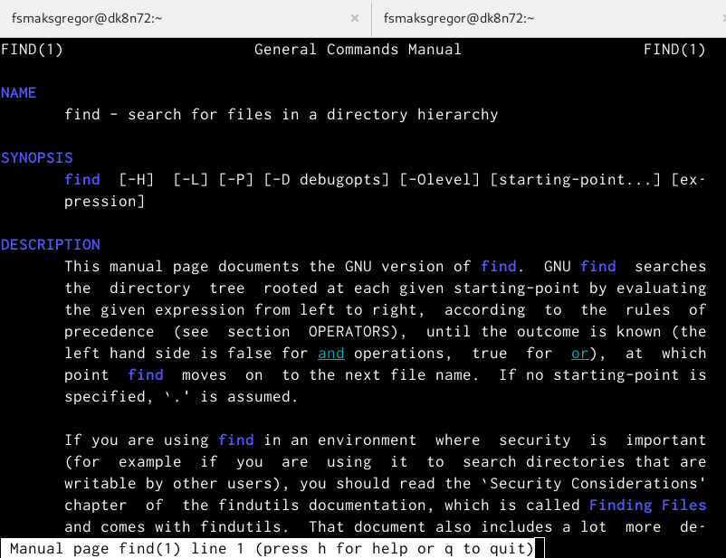{#fig:18 width=110%}
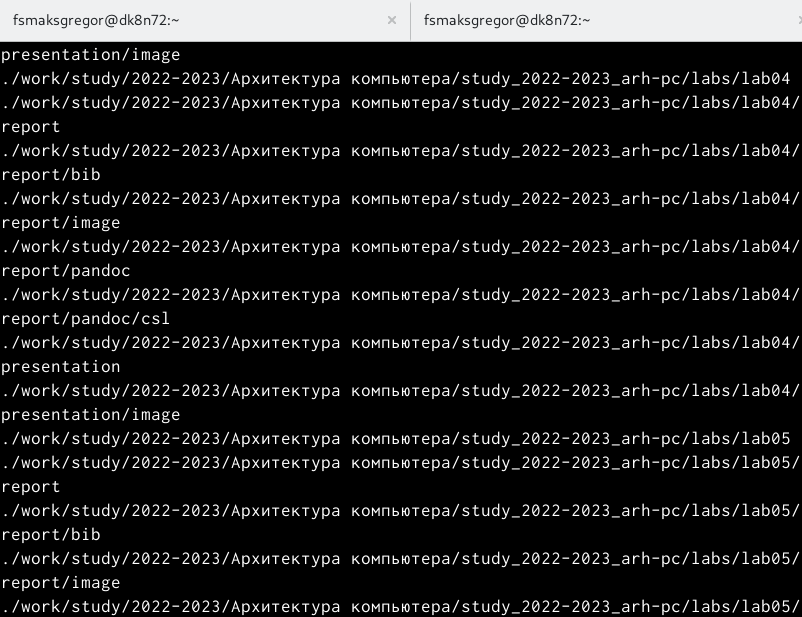{#fig:19 width=110%}

## Выводы

- В процессе выполнения лабораторной работы ознакомилась с инструментами
поиска файлов и фильтрации текстовых данных. Приобрела практические на-
выки: по управлению процессами (и заданиями), по проверке использования
диска и обслуживанию файловых систем.

