---
## Front matter
lang: ru-RU
title: Лабораторная Работа №7
subtitle: Простейший шаблон
author:
  - Сильвен Макс Грегор Филс , НКАбд-03-22
  
## i18n babel
babel-lang: russian
babel-otherlangs: english

## Formatting pdf
toc: false
toc-title: Содержание
slide_level: 2
aspectratio: 169
section-titles: true
theme: metropolis
header-includes:
 - \metroset{progressbar=frametitle,sectionpage=progressbar,numbering=fraction}
 - '\makeatletter'
 - '\beamer@ignorenonframefalse'
 - '\makeatother'
---
## Цель работы

Познакомиться с операционной системой Linux. Получить практические навыки рабо-
ты с редактором vi, установленным по умолчанию практически во всех дистрибутивах.

## Задание

Последовательность выполнения работы
1. Ознакомиться с теоретическим материалом. 
2. Ознакомиться с редактором vi. 
3. Выполнить упражнения, используя
команды vi.
## Задание 1. Создание нового файла с использованием vi. 
1. Создайте каталог с именем ~/work/os/lab06. 
2. Перейдите во вновь созданный каталог. 
3. Вызовите vi и создайте файл hello.sh. 
4. Нажмите клавишу i и вводите следующий текст.
5. Нажмите клавишу Esc для перехода в командный режим после завершения
ввода текста. 
## Задание 1. Создание нового файла с использованием vi.
6. Нажмите : для перехода в режим последней строки и внизу вашего экрана появится приглашение в виде двоеточия. 
7. Нажмите w (записать)и q (выйти), а затем нажмите клавишу Enter для сохранения вашего текста и завершения работы. 
8. Сделайте файл исполняемым

## Задание 2. Редактирование существующего файла 
1. Вызовите vi на редактирование файла (vi ~/work/os/lab06/hello.sh) 
2. Установите курсор в конец слова HELL второй строки. 
3. Перейдите в режим вставки и замените на HELLO. Нажмите
Esc для возврата в командный режим. 
4. Установите курсор на четвертую строку и сотрите слово LOCAL. 
5. Перейдите в режим вставки и наберите следующий текст: local, нажмите Esc для возврата в командный режим. 
## Задание 2. Редактирование существующего файла
6. Установите курсор на последней строке файла. Вставьте после неё строку, содержащую следующий
текст: echo $HELLO. 
7. Нажмите Esc для перехода в командный режим. 
8. Удалите последнюю строку. 
9. Введите команду отмены изменений u для отмены последней команды.
10. Введите символ : для перехода в режим последней строки.
Запишите произведённые изменения и выйдите из vi.

## Теоретическое введение
В большинстве дистрибутивов Linux в качестве текстового редактора по умолча-
нию устанавливается интерактивный экранный редактор vi (Visual display editor).
Редактор vi имеет три режима работы: - командный режим — предназначен для
ввода команд редактирования и навигации по редактируемому файлу; - режим
вставки — предназначен для ввода содержания редактируемого файла; - режим
последней (или командной) строки — используется для записи изменений в файл
и выхода из редактора.
## Теоретическое введение
 Для вызова редактора vi необходимо указать команду vi и
имя редактируемого файла: vi При этом в случае отсутствия файла с указанным
именем будет создан такой файл. Переход в командный режим осуществляется
нажатием клавиши Esc . Для выхода из редактора vi необходимо перейти в режим
последней строки: находясь в командном режиме, нажать Shift-; (по сути символ
: — двоеточие), затем: - набрать символы wq, если перед выходом из редактора
требуется записать изменения в файл; - набрать символ q (или q!), если требуется
выйти из редактора без сохранения. [vii:bash?]

## Выполнение лабораторной работы

## Последовательность выполнения работы 
1. Ознакомиться с теоретическим материалом. 
2. Ознакомиться с редактором vi. 
## Последовательность выполнения работы
3. Выполнить упражнения, используя команды vi.

(рис. [-@fig:fig1])(рис. [-@fig:fig2])

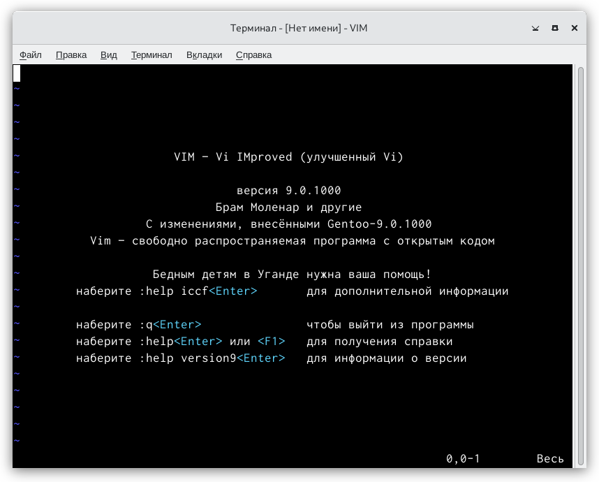{ #fig:fig1 width=110% }

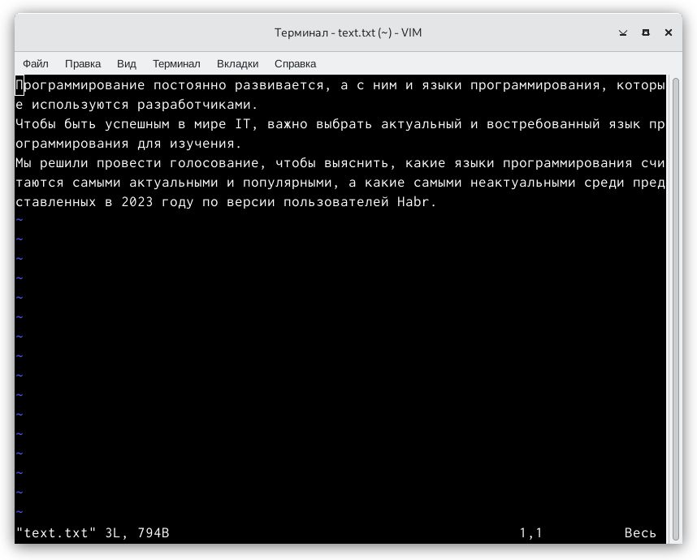{ #fig:fig2 width=110% }

## Задание 1. Создание нового файла с использованием vi. 
1. Создайте каталог с именем ~/work/os/lab06. 
2. Перейдите во вновь созданный каталог. 
## Задание 1. Создание нового файла с использованием vi.
3. Вызовите vi и создайте файл hello.sh. (рис. [-@fig:fig3])(рис. [-@fig:fig4])

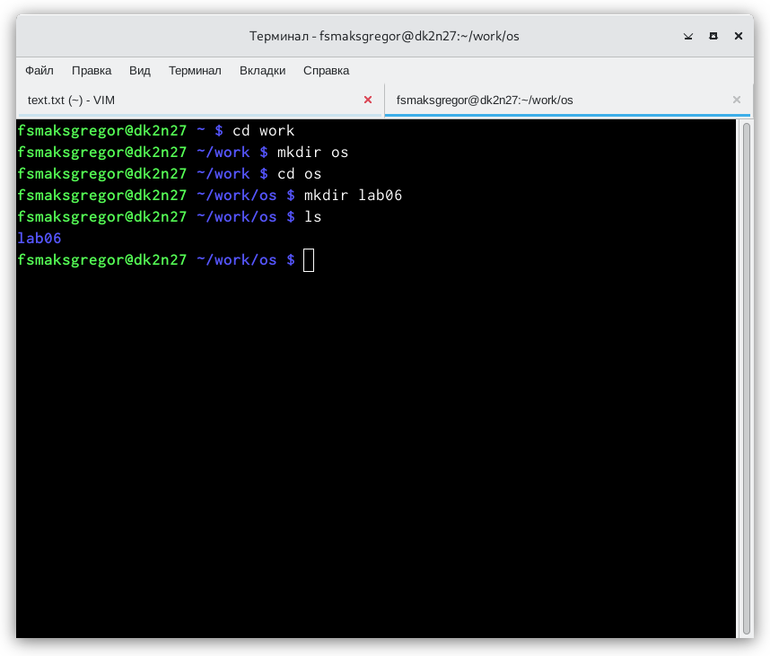{ #fig:fig3 width=110% }

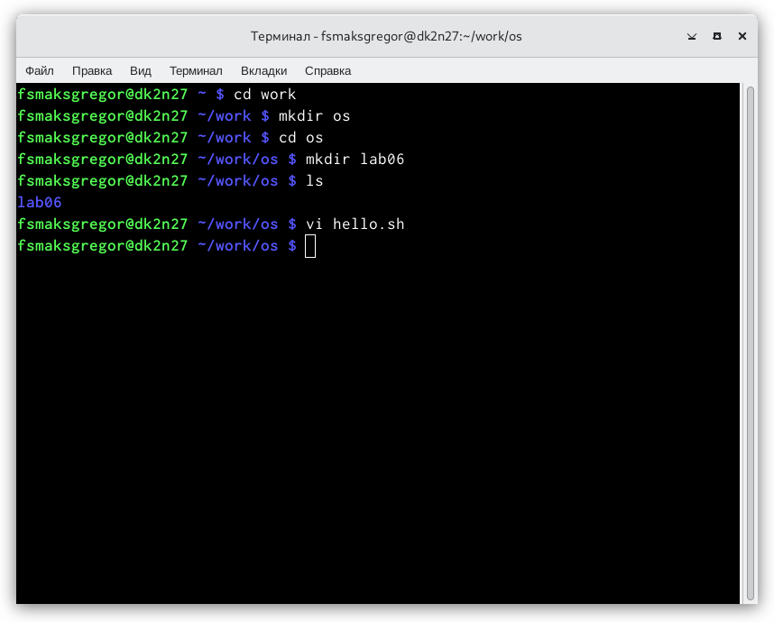{ #fig:fig4 width=110% }

## Задание 1. Создание нового файла с использованием vi.
4. Нажмите клавишу i и вводите следующий текст. (рис. [-@fig:fig5])

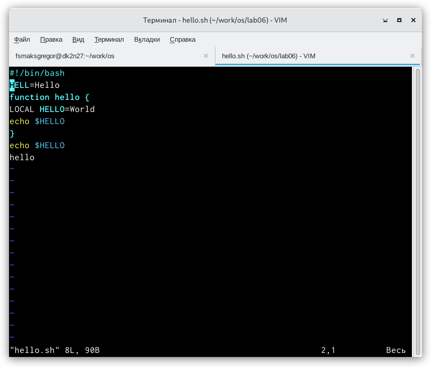{ #fig:fig5 width=110% }

5. Нажмите клавишу Esc для перехода в командный режим после завершения
ввода текста.
6. Нажмите : для перехода в режим последней строки и внизу вашего экрана
появится приглашение в виде двоеточия.
## Задание 1. Создание нового файла с использованием vi.
7. Нажмите w (записать) и q (выйти), а затем нажмите клавишу Enter для
сохранения вашего текста и завершения работы.(рис. [-@fig:fig6])

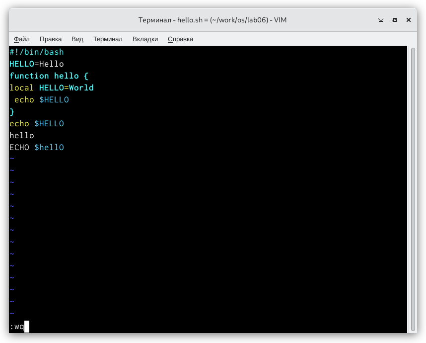{ #fig:fig6 width=110% }

## Задание 1. Создание нового файла с использованием vi.
8. Сделайте файл исполняемым
(рис. [-@fig:fig7])(рис. [-@fig:fig8])

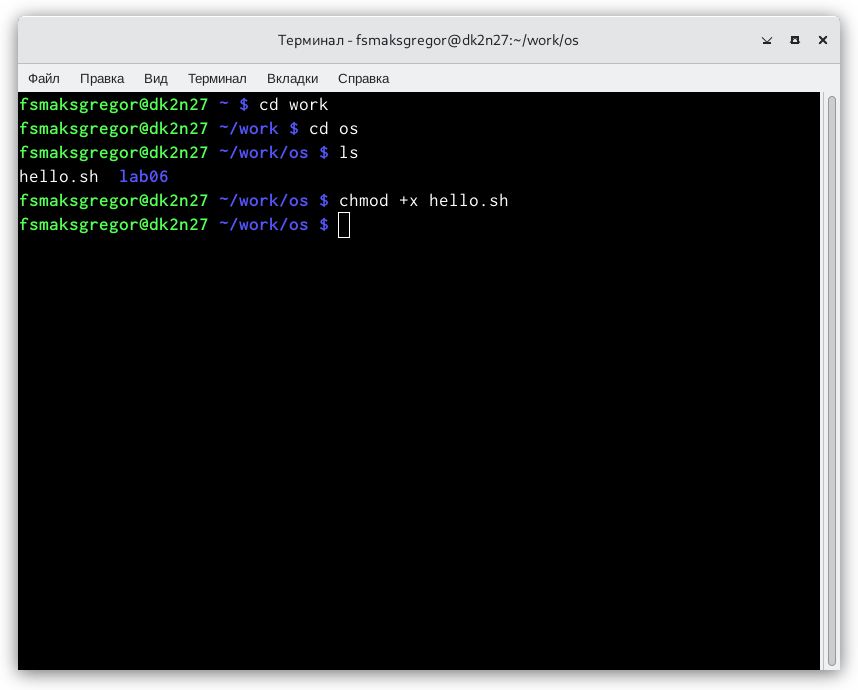{ #fig:fig7 width=110% }

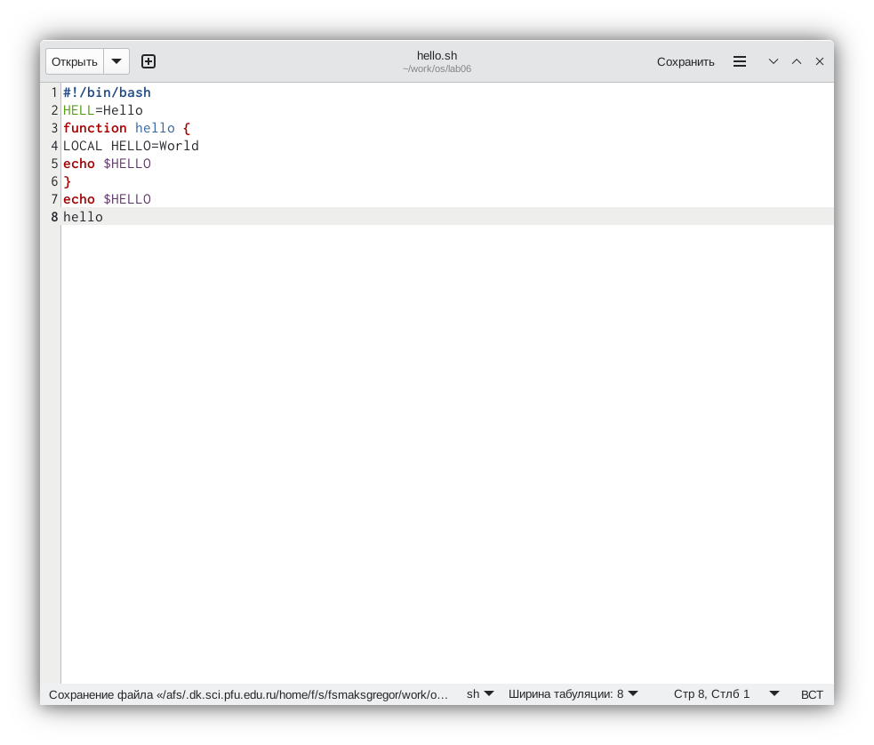{ #fig:fig8 width=110% }

## Задание 2. Редактирование существующего файла 
1. Вызовите vi на редактирование файла (vi ~/work/os/lab06/hello.sh) 
2. Установите курсор в конец слова HELL второй строки. 
## Задание 2. Редактирование существующего файла
3. Перейдите в режим вставки и замените на HELLO. Нажмите Esc
для возврата в командный режим.(рис. [-@fig:fig9])

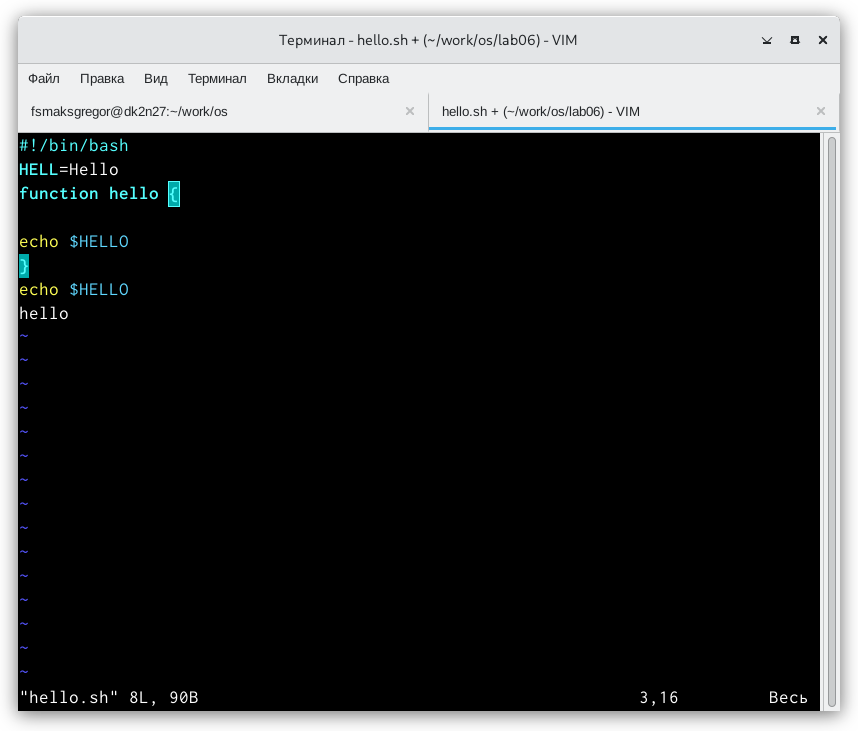{ #fig:fig9 width=110% }

## Задание 2. Редактирование существующего файла
4. Установите курсор на четвертую строку и сотрите слово LOCAL.
## Задание 2. Редактирование существующего файла
5. Перейдите в режим вставки и наберите следующий текст: local, нажмите
Esc для возврата в командный режим.(рис. [-@fig:fig10])

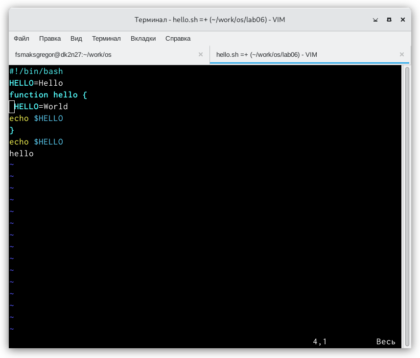{ #fig:fig10 width=110% }

## Задание 2. Редактирование существующего файла
6. Установите курсор на последней строке файла. Вставьте после неё строку, содержащую следующий текст: echo $HELLO.(рис. [-@fig:fig10.1])

{ #fig:fig10.1 width=110% }

## Задание 2. Редактирование существующего файла
7. Нажмите Esc для перехода в командный режим.
8. Удалите последнюю строку. (рис. [-@fig:fig11])

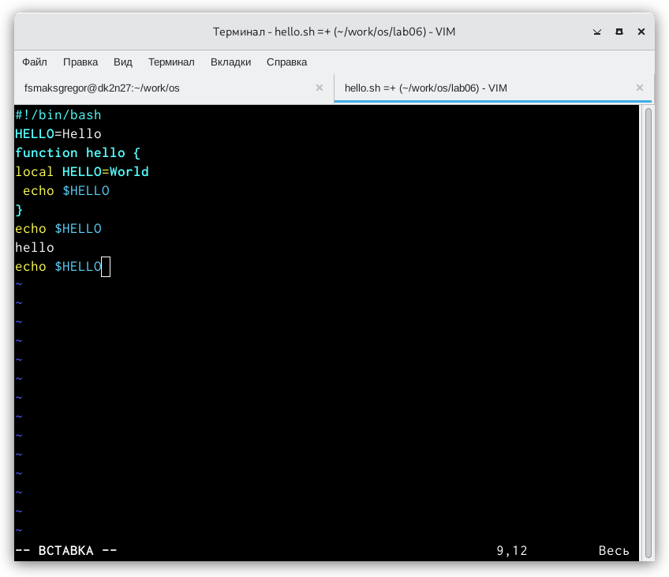{ #fig:fig11 width=110% }

## Задание 2. Редактирование существующего файла
9. Введите команду отмены изменений u для отмены последней команды.(рис. [-@fig:fig12])

{ #fig:fig12 width=110% }

## Задание 2. Редактирование существующего файла
10. Введите символ : для перехода в режим последней строки. Запишите про-
изведённые изменения и выйдите из vi.

## Выводы

В процессе выполнения лабораторной работы я познакомилась с операцион-
ной системой Linux. Получила практические навыки работы с редактором vi,
установленным по умолчанию практически во всех дистрибутивах.

## Спасибо за ваше внимание !
