---
## Front matter
lang: ru-RU
title: Лабораторная Работа №9
subtitle: Простейший шаблон
author:
  - Сильвен Макс Грегор Филс , НКАбд-03-22

## i18n babel
babel-lang: russian
babel-otherlangs: english

## Formatting pdf
toc: false
toc-title: Содержание
slide_level: 2
aspectratio: 169
section-titles: true
theme: metropolis
header-includes:
 - \metroset{progressbar=frametitle,sectionpage=progressbar,numbering=fraction}
 - '\makeatletter'
 - '\beamer@ignorenonframefalse'
 - '\makeatother'
---

## Цель работы

- Познакомиться с операционной системой Linux. Получить практические навыки рабо-
ты с редактором Emacs.

# Задание

## Последовательность выполнения работы 
1. Ознакомиться с теоретическим
материалом. 
2. Ознакомиться с редактором emacs. 
3. Выполнить упражнения. 
4. Ответить на контрольные вопросы.

## Основные команды emacs 

1. Открыть emacs. 
2. Создать файл lab07.sh с помощью
комбинации Ctrl-x Ctrl-f (C-x C-f). 
3. Наберите текст, который дан. 
4. Сохранить
файл с помощью комбинации Ctrl-x Ctrl-s (C-x C-s).
## Основные команды emacs 
5. Проделать с текстом стан-
дартные процедуры редактирования, каждое действие должно осуществляться
комбинацией клавиш. 
5.1. Вырезать одной командой целую строку (С-k). 
5.2. Вста-
вить эту строку в конец файла (C-y). 
5.3. Выделить область текста (C-space). 
5.4.Скопировать область в буфер обмена (M-w). 
5.5. Вставить область в конец файла.
5.6. Вновь выделить эту область и на этот раз вырезать её (C-w). 
5.7. Отмените последнее действие (C-/). 
## Основные команды emacs 
6. Научитесь использовать команды по перемещению курсора. 
6.1. Переместите курсор в начало строки (C-a). 
6.2. Переместите курсор
в конец строки (C-e). 
6.3. Переместите курсор в начало буфера (M-<). 
6.4. Переместите курсор в конец буфера (M->). 
## Основные команды emacs 
7. Управление буферами. 
7.1. Вывести список
активных буферов на экран (C-x C-b). 
7.2. Переместитесь во вновь открытое окно
(C-x) o со списком открытых буферов и переключитесь на другой буфер. 
7.3. Закройте это окно (C-x 0). 
7.4. Теперь вновь переключайтесь между буферами, но уже без вывода их списка на экран (C-x b). 
## Основные команды emacs 
8. Управление окнами. 
8.1. Поделите
фрейм на 4 части: разделите фрейм на два окна по вертикали (C-x 3), а затем
каждое из этих окон на две части по горизонтали (C-x 2). 
8.2. В каждом из четырёх
созданных окон откройте новый буфер (файл) и введите несколько строк текста.
## Основные команды emacs 
9. Режим поиска 
9.1. Переключитесь в режим поиска (C-s) и найдите несколько слов, присутствующих в тексте. 
9.2. Переключайтесь между результатами поиска,нажимая C-s. 
9.3. Выйдите из режима поиска, нажав C-g. 
9.4. Перейдите в режим поиска и замены (M-%), введите текст, который следует найти и заменить,
нажмите Enter , затем введите текст для замены. После того как будут подсвече-
ны результаты поиска, нажмите ! для подтверждения замены. 
9.5. Испробуйте другой режим поиска, нажав M-s o. Объясните, чем он отличается от обычного
режима?

## Теоретическое введение

Emacs — один из наиболее мощных и широко распространённых редакторов,
используемых в мире UNIX. По популярности он соперничает с редактором vi и
его клонами. В зависимости от ситуации, Emacs может быть:
• текстовым редактором;
• программой для чтения почты и новостей Usenet;
• интегрированной средой разработки (IDE);
• операционной системой;
Всё это разнообразие достигается благодаря архитектуре Emacs, которая поз-
воляет расширять возможности редактора при помощи языка Emacs Lisp. На
языке C написаны лишь самые базовые и низкоуровневые части Emacs, включая
полнофункциональный интерпретатор языка Lisp. Таким образом, Emacs имеет
встроенный язык программирования, который может использоваться для на-
стройки, расширения и изменения поведения редактора. В действительности,
большая часть того редактора, с которым пользователи Emacs работают в наши
дни, написана на языке Lisp.
Первая версия редактора Emacs была написана в 70-х годах 20-го столетия
Richard Stallman (Ричардом Столманом) как набор макросов для редактора TECO
. В дальнейшем, уже будучи основателем Фонда Свободного программного обес-
печения Free Software Foundation и проекта GNU, Stallman разработал GNU Emacs
в развитие оригинального Emacs и до сих пор сопровождает эту программу.
Emacs является одним из старейших редакторов. Он использовался тысячами
программистов на протяжении последних 20 с лишним лет, для него создано
много дополнительных пакетов расширений. Эти дополнения позволяют де-
лать с помощью Emacs такие вещи, которые Stallman , вероятно, даже не считал
возможными в начале своей работы над редактором. [Em:bash?]

## Выполнение лабораторной работы

1. Открыть emacs.(рис. @fig:001)

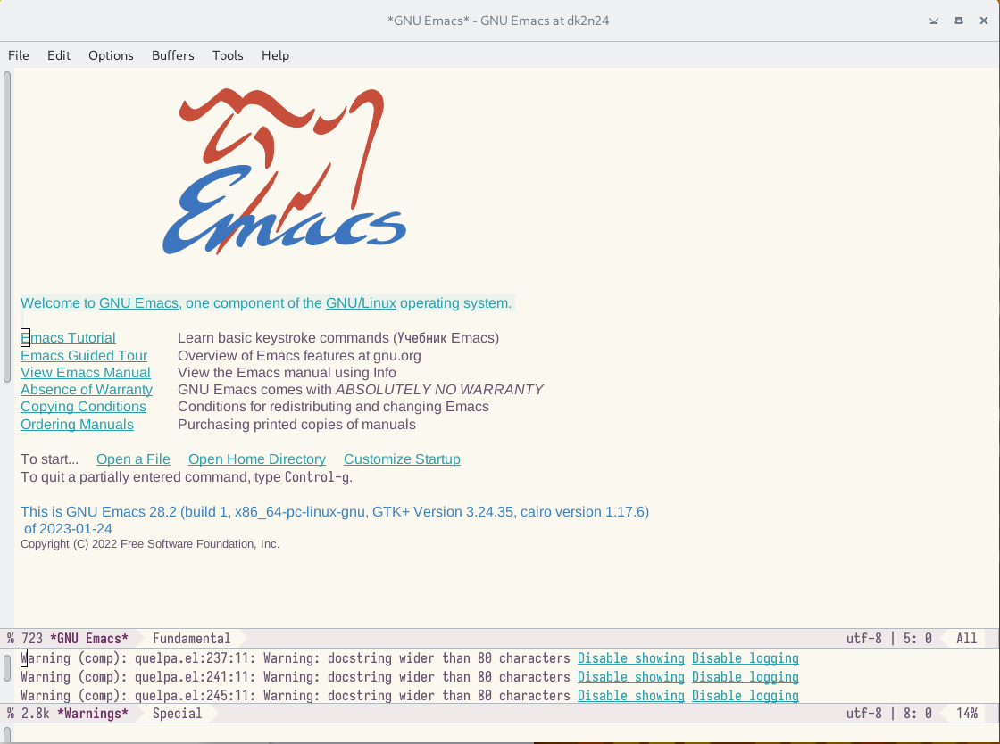{@fig:001 width=100%}

## Выполнение лабораторной работы
2. Создать файл lab07.sh с помощью комбинации Ctrl-x Ctrl-f (C-x C-f).(рис. @fig:002)

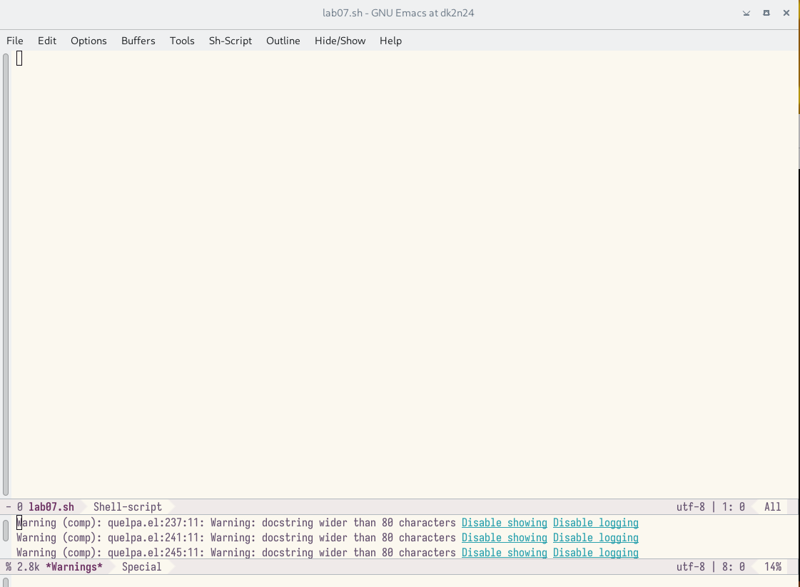{@fig:002 width=100%}

## Выполнение лабораторной работы
3. Наберите текст, который дан.
4. Сохранить файл с помощью комбинации Ctrl-x Ctrl-s (C-x C-s).(рис. @fig:003)

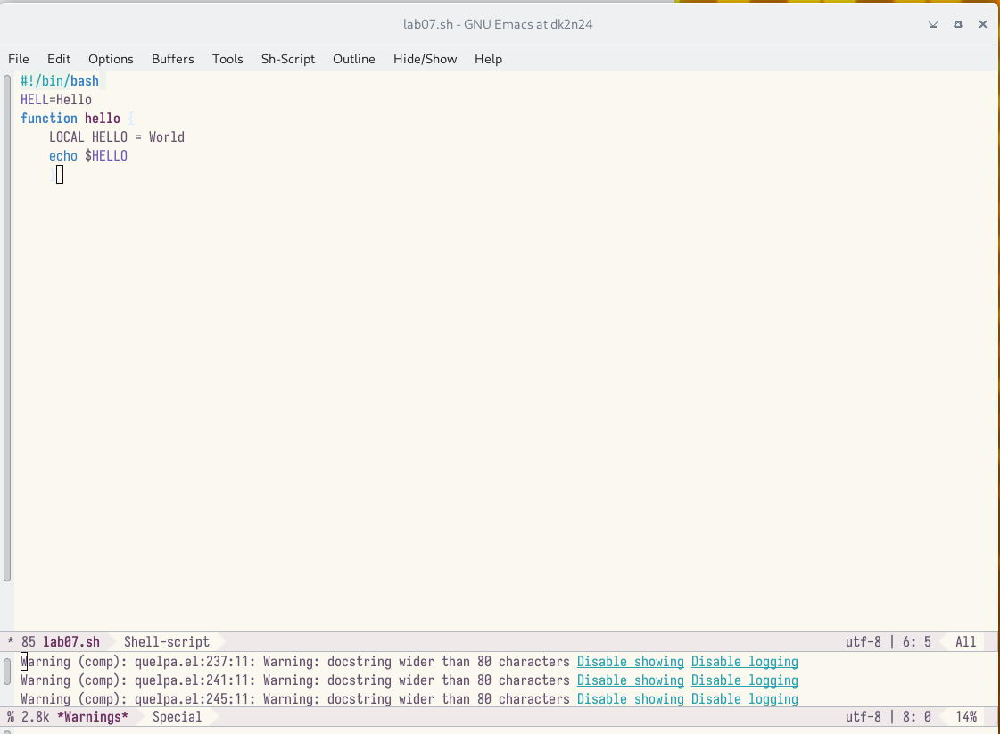{@fig:003 width=100%}

## Выполнение лабораторной работы
5. Проделать с текстом стандартные процедуры редактирования, каждое дей-
ствие должно осуществляться комбинацией клавиш. 5.1. Вырезать одной
командой целую строку (С-k).(рис. @fig:004)

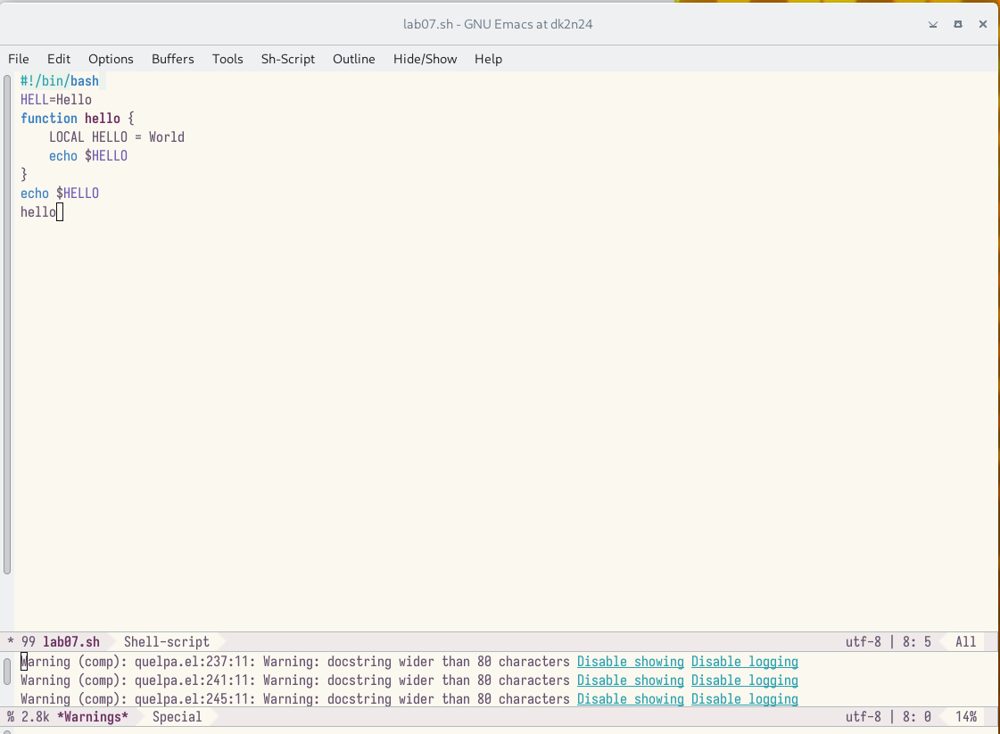{@fig:004 width=100%}

## Выполнение лабораторной работы
5.2. Вставить эту строку в конец файла (C-y).(рис. @fig:005)

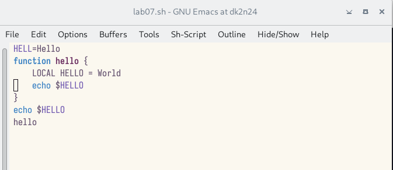{@fig:005 width=100%}

## Выполнение лабораторной работы

5.3. Выделить область текста (C-space). 5.4. Скопировать область в буфер обмена
(M-w). 5.5. Вставить область в конец файла.(рис. @fig:006)

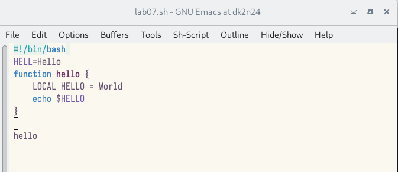{#fig:006 width=100%}

## Выполнение лабораторной работы
5.6. Вновь выделить эту область и на этот раз вырезать её (C-w).(рис. @fig:007)

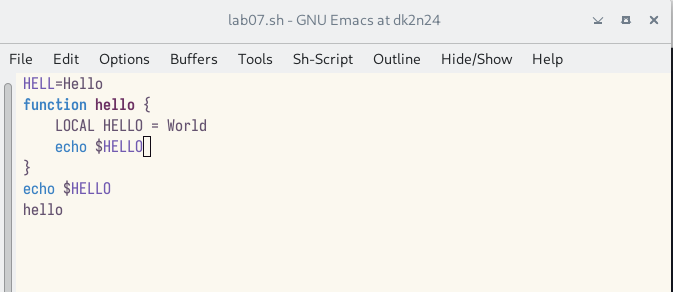{@fig:007 width=100%}

## Выполнение лабораторной работы
5.7. Отмените последнее действие (C-/)(рис. @fig:008)

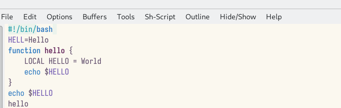@fig:008 width=100%}

## Выполнение лабораторной работы
6. Научитесь использовать команды по перемещению курсора. 6.1. Переме-
стите курсор в начало строки (C-a).(рис. @fig:009)

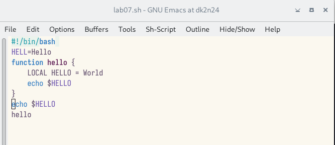{@fig:009 width=100%}

## Выполнение лабораторной работы
6.2. Переместите курсор в конец строки (C-e). (рис. @fig:010)

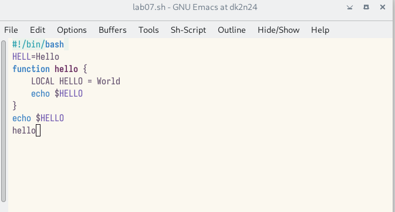{@fig:010 width=100%}

## Выполнение лабораторной работы
6.3. Переместите курсор в начало буфера (M-<). 6.4. Переместите курсор в конец
буфера (M->). 

7. Управление буферами. 

7.1. Вывести список активных буферов на
экран (C-x C-b).(рис. @fig:011)

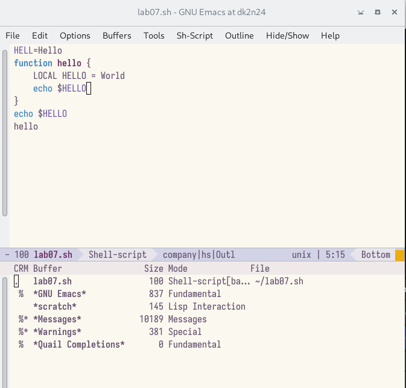{@fig:011 width=100%}

## Выполнение лабораторной работы

7.2. Переместитесь во вновь открытое окно (C-x) o со списком открытых буфе-
ров и переключитесь на другой буфер.(рис. @fig:0012)

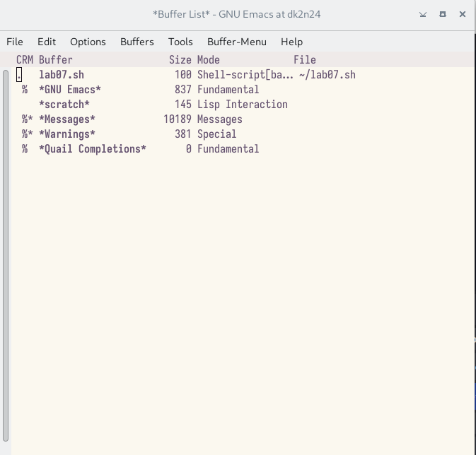{@fig:0012 width=100%}

## Выполнение лабораторной работы

7.3. Закройте это окно (C-x 0). 7.4. Теперь вновь переключайтесь между буфе-
рами, но уже без вывода их списка на экран (C-x b). 8. Управление окнами. 8.1.
Поделите фрейм на 4 части: разделите фрейм на два окна по вертикали (C-x 3), а
затем каждое из этих окон на две части по горизонтали (C-x 2). (рис. @fig:0013)

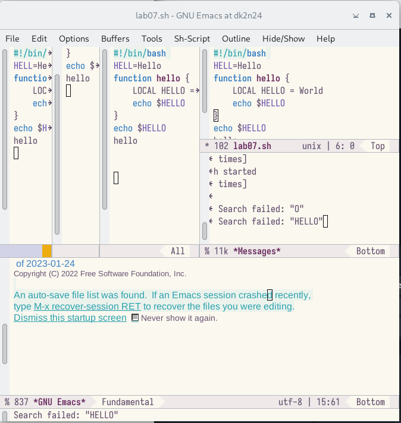{@fig:0013 width=100%}

## Выполнение лабораторной работы
8.2. В каждом из четырёх созданных окон откройте новый буфер (файл) и
введите несколько строк текста. (рис. @fig:0014)

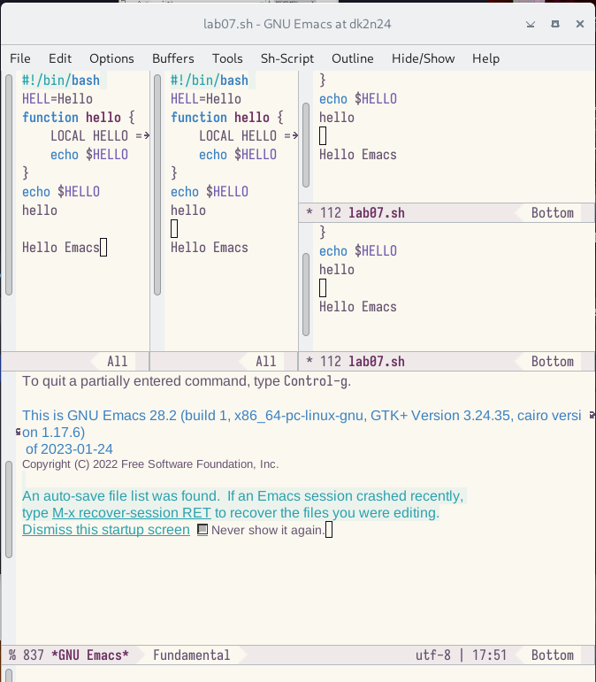{@fig:0014 width=100%}

## Выполнение лабораторной работы
9. Режим поиска 9.1. Переключитесь в режим поиска (C-s) и найдите несколько
слов, присутствующих в тексте.(рис. @fig:0015)

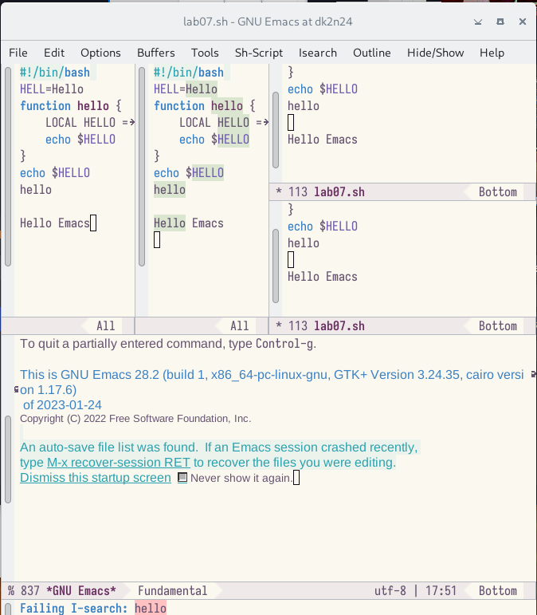{@fig:0015 width=100%}

## Выполнение лабораторной работы
9.2. Переключайтесь между результатами поиска, нажимая C-s.(рис. @fig:0016)

{@fig:0016 width=100%}

## Выполнение лабораторной работы
9.3. Выйдите из режима поиска, нажав C-g. 9.4. Перейдите в режим поиска и
замены (M-%), введите текст, который следует найти и заменить, нажмите Enter ,
затем введите текст для замены. После того как будут подсвечены результаты
поиска, нажмите ! для подтверждения замены.(рис. @fig:0017)

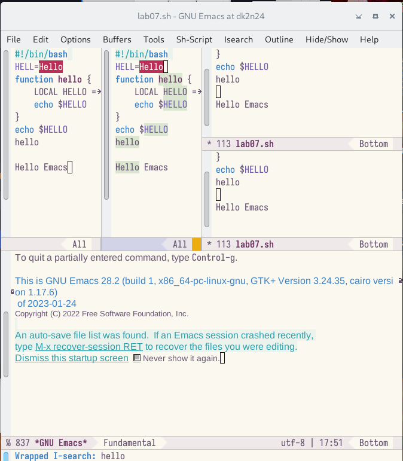{@fig:0017 width=100%}

## Выполнение лабораторной работы
9.5. Испробуйте другой режим поиска, нажав M-s o. Объясните, чем он отлича-
ется от обычного режима?
Отличие от обычного режима в том, что тут появляется отдельное окно с тек-
стом из файла с выделенными словами, которые нужно было найти.(рис. @fig:0018)

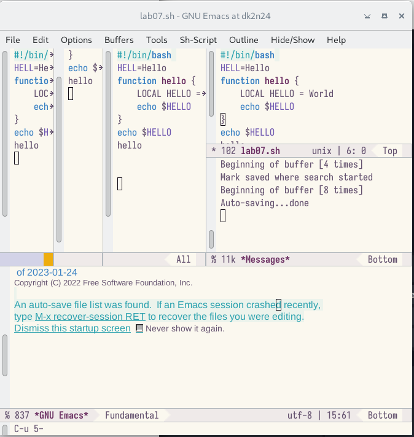{@fig:0018 width=100%}

# Выводы

В процессе выполнения лабораторной работы я получила практические навыки
работы в редакторе Emacs.

## Спасибо за ваше внимание !
